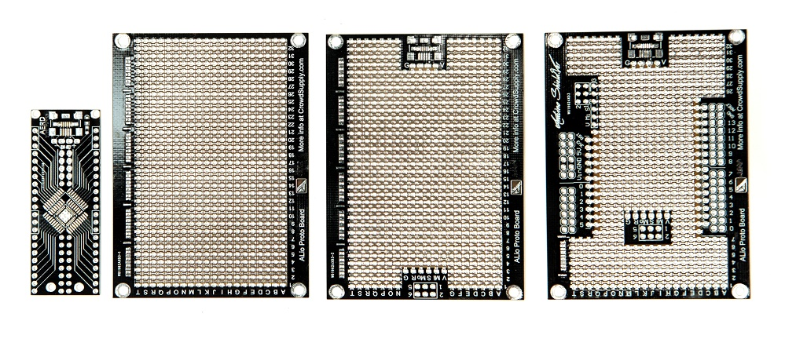

# ALio-protoboard
**ALio Proto Board: The ALL-in-One Prototyping Board**

## Board's Rules
* **Layers**: 2 Layers
* **Min Traces**: 6 mill
* **Min Clearance**: 6 mill
* **Min Holes**: 0.3 mm
* **Via Process**: Tenting vias
* **Finished Copper**: 1 oz Cu

## Board Spesifications
* **Size**: L x W x H : 88.2 mm x 65.3 mm x 1 mm
* **PCB**: FR4 0.8 mm (optional)
* **Finishing**: HASL-lead (optional)
* **Solder Mask**: Black (optional)
* **Silkscreen**: White (optional)

## Orders and contact
[Crowd Supply](https://www.crowdsupply.com/aerd/alio-proto-board)

## License
The "Creative Commons Attribution-ShareAlike 4.0 International License" [(CC BY-SA 4.0)](https://creativecommons.org/licenses/by-sa/4.0/).
