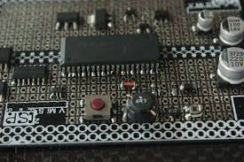
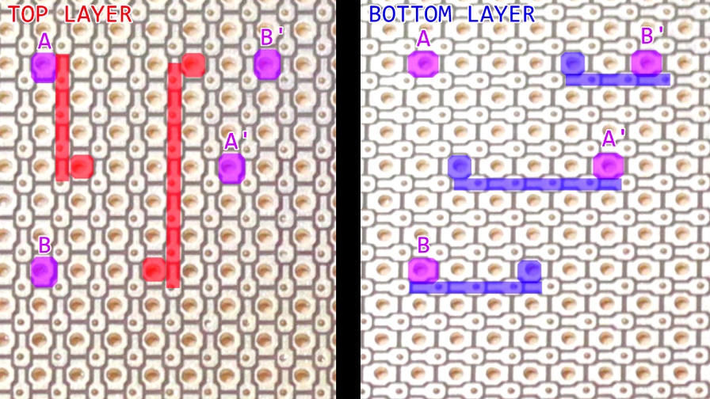

# ALio Proto Board
**The ALL-in-One Prototyping Board**

ALio Proto Board is a prototyping board designed for electronic hobbyists who want to make prototypes containing SMD and through-hole components without using an extra breakout board. ALio is compatible with the traditional proto board while including all the features and benefits of traditional proto board. 

ALio lets you freely attach SMD component in any location or direction, so you can forget about using an extra SMD breakout board, ALio fits almost all SMD components. ALio is great for beginners, since it is easy to solder and allows you to move your bread-board project to a permanent proto board project.

The Embedded and Arduino compatible versions provide SPI breakout, since SPI is the most common protocol and because wiring SPI directly to a microcontroller can be challenging. 

Because every project needs power, ALio provides a 2-in-1 Micro-USB/Mini-USB pad, so powering and connecting your project is easy.

***

## How to Use ALio
ALio comes with a unique and different orientation NON-through-hole BUS pad designed to be used for SMD components or routing circuits as double layer.

Point-to-point wiring is easy with ALio, just a blob of solder does the trick. In addition, the double layer bus lets you route as circuits as if they were on a double-layer PCB, so you can forget about using wire jumpers. This is great for quickly prototyping stackable circuits.

## ALio MCU Break Out Board
ALio MCU Break Out Board is not like ordinary one. It is designed to fit TQFP44, TQFP32, MLF32, and SOIC IC packages on one side. On the other side, it has a unique pad to fit SMD components for your microcontroller’s minimum requirements, such as capacitors, inductors, crystals, resistors, or LEDs. It also has a mini-USB/micro-USB pad, so you can use it as a stand-alone microcontroller board.

***

## Features
* Fits SMD and PTH components at the same time.
* Has a double-layer BUS for wire-free connections.
* Has a Micro-SD/SD card breakout or any general SMD sockets.
* Has an SPI break out pad for some variant.
* Has a 2-in-1 micro-USB and mini-USB pad for some variant.
* No more SOIC-break out boards needed, this board fits all SOIC, SOP, and SO type ICs

## Spesifications
* **Size**: L x W x H : 88.2 mm x 65.3 mm x 1 mm
* **PCB**: FR4 0.8 mm (optional)
* **Finishing**: HASL-lead (optional)
* **Solder Mask**: Black (optional)
* **Silkscreen**: White (optional)

## Rules
* **Layers**: 2 Layers
* **Min Traces**: 6 mill
* **Min Clearance**: 6 mill
* **Min Holes**: 0.3 mm
* **Via Process**: Tenting vias
* **Finished Copper**: 1 oz Cu

## Orders and Contact
[Crowd Supply](https://www.crowdsupply.com/aerd/alio-proto-board) - Order

[Hackaday](https://hackaday.io/project/28570-alio-new-hardware-prototyping-platform) - Discussion

## ToDo
* Create pad library for eagle.
* Create USB footprint for eagle.
* Create 1.1mm pitch dor eagle.

## License
The "Creative Commons Attribution-ShareAlike 4.0 International License" [(CC BY-SA 4.0)](https://creativecommons.org/licenses/by-sa/4.0/).
